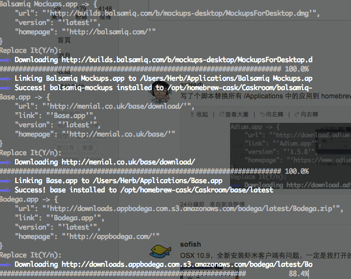

# homebrew-cask-replacer

use homebrew cask to replace installed apps



## usage

```bash

pip install -r requirements.txt
python brew_cask_replacer.py

```
## how it works

* skip {application} from Appstore [-f turnoff]
* check http://raw.github.com/caskroom/homebrew-cask/master/Casks/{application} is exist
* print application info and check if you want to replace it with brew cask [-y yes to all]
* install application using 'brew cask install {application}'
* send {application_path} to trash (may fail)
